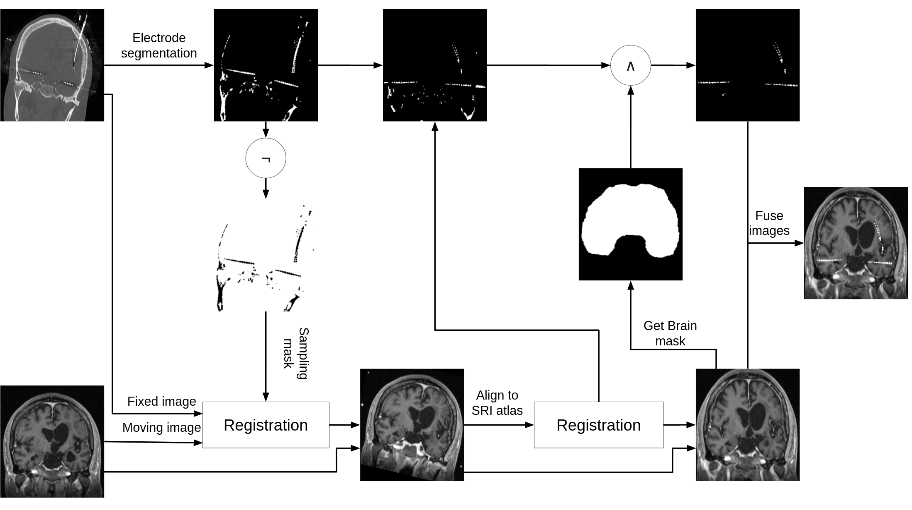
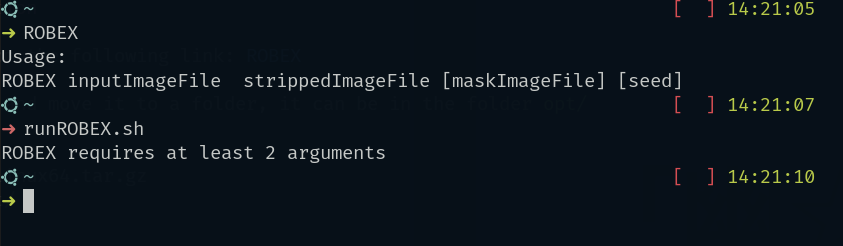

# SEEGFusion

Fuse a CT image with a MRI image from an Stereotactic ElectroEncephalography (SEEG).



## Prerequisites

To use SEEGFusion  The following software and toolkits are required

* SimpleITK
* ROBEX

## ROBEX Installation

Downloas ROBEX from the following link: [ROBEX](https://www.nitrc.org/frs/download.php/5994/ROBEXv12.linux64.tar.gzjk)

Extract the files and move it to a folder, it can be in the folder `opt/`

```Shell
tar -xf ROBEXv12.linux64.tar.gz
sudo mv ROBEX /opt/
```

Add the directory to the environment variables in `~/.bashrc`

```Shell
ROBEX=/opt/ROBEX
export ROBEX

PATH=${PATH}:$ROBEX
```

Validate that the ROBEX commands are detected by the sytems

```Shell
source ~/.bashrc

runROBEX.sh
```



## SimpleITK Installation

Install using python pip, [SimpleITK](https://simpleitk.readthedocs.io/en/master/gettingStarted.html)

```shell
pip install SimpleITK
```

---------------------

## Setu up virtual environment for python

```shell
python -m venv venv
source  venv/bin/activate
pip install -r python/requirements.txt
```

### Fue 2 images

To fuse two images use the script in `python/src/Fuse.py`

```shell
python Fuse.py ct_path mri_path output_path
```
